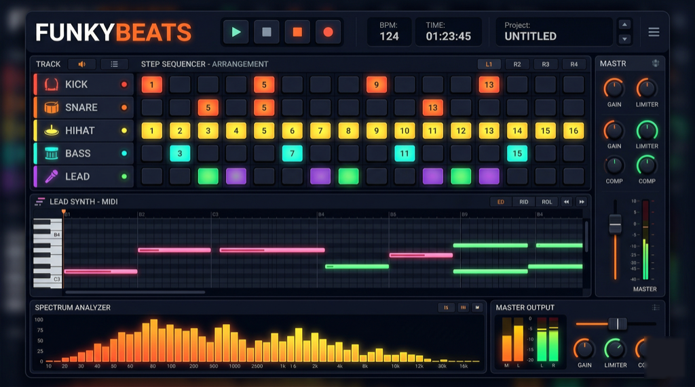

# FunkyBeats

### Browser-based Electronic Music Production Studio

<p align="center">
  
</p>

<p align="center">


</p>

---

FunkyBeats is a fully functional DAW (Digital Audio Workstation) that runs entirely in the browser. Inspired by FL Studio, it synthesizes every sound in real time using the **Web Audio API** -- no samples required, no server, no build pipeline. Open `index.html` and start producing House, Funk, and Disco tracks.

---

## Quick Start

No installation, no build step, no Node.js.

```bash
git clone https://github.com/pepperonas/funkybeats.git
cd funkybeats
open index.html        # macOS
xdg-open index.html    # Linux
# or double-click index.html in Windows Explorer
```

Click any step in the sequencer to hear the sound. Press **Space** to play.

---

## Feature Overview

### Step Sequencer

- **11 channels**: Kick, Snare, HiHat, Clap, Perc, Bass, Lead, Pad, Chord, Stab, Organ
- **Variable pattern length**: 16, 32, or 64 steps per pattern
- **8 independent patterns** with copy/paste/clear
- Drag-to-paint: click and drag across steps to toggle multiple
- Sound preview on step activation -- hear the sound when you place it
- Mute/Solo per channel
- Open HiHat toggle (Shift+Click) with closed-hat choke
- Live playhead with step indicators

### Piano Roll

- Canvas-based note editor for all melodic channels (Bass, Lead, Pad, Chord, Stab, Organ)
- **Variable note length**: drag right to extend notes across steps
- **Velocity lane**: bottom 60px for per-note velocity editing via click/drag
- **Zoom**: Ctrl+Wheel to zoom, Shift+Wheel to scroll
- **Selection mode**: click-drag to select, Ctrl+C/V to copy/paste notes
- Octave navigation (1-7 range)
- QWERTY keyboard input (Z-M = C-B, Shift = octave up)

### Automation Lanes

- Dedicated **AUTOMATION** tab with canvas curve editor
- Click to set points, drag to draw curves, right-click to delete
- Automatable parameters:
  - Master: Filter, Resonance, Reverb, Delay, Distortion
  - Per-channel: Volume, Filter Cutoff
- Smooth playback via Web Audio `linearRampToValueAtTime`
- **Filter sweeps are the #1 production technique in Disco/House -- now fully supported**

### Synth Editor

- Per-channel sound design panel
- **Drum channels** (Kick/Snare/HiHat/Clap/Perc): Tune, Decay, Tone, Drive
- **Synth channels** (Bass/Lead/Pad/Chord/Stab/Organ): Waveform, Attack, Decay, Cutoff, Resonance, Detune, Glide
- **Chord channel**: selectable chord type (Major, Minor, 7th, min7)
- **Sample playback**: load WAV/MP3 files to replace synthesis on any channel

### Mixer

- Volume fader + stereo pan per channel
- **3-band EQ** per channel (Low 80Hz / Mid 1kHz / High 8kHz, +/-12dB)
- **Per-channel reverb/delay sends**
- VU meters with green-yellow-red gradient
- Mute/Solo per channel
- **DRUMS bus** and **SYNTHS bus** with independent compressors
- Master channel with master fader

### Effects Rack

| Effect | Range | Type |
|--------|-------|------|
| Reverb | 0-100% | Convolver with synthesized 2s impulse response |
| Delay | 0-100% | Feedback delay with BPM sync (1/16 to 1/1) |
| Filter | 100Hz-20kHz | Master lowpass |
| Resonance | 0-30 | Filter Q |
| Distortion | 0-100% | Waveshaper, 4x oversampling |
| Compressor | 0-100% | Dynamic threshold/ratio |
| Chorus | 0-100% | Dual detuned delay lines with LFO |
| Phaser | 0-100% | Allpass filter chain with LFO |
| Flanger | 0-100% | Short modulated delay with feedback |
| Bitcrusher | 0-100% | Bit depth and sample rate reduction |
| Master Volume | 0-100% | Post-compressor output gain |

### Sidechain Pump

- Kick-triggered ducking on all non-kick channels
- Configurable source channel (not just kick)
- Amount and Release controls
- **The classic House/EDM pumping effect**

### Arrangement View

- Full playlist/timeline replacing the simple song chain
- **8 tracks x 64 bars** canvas-based arrangement
- Paint pattern blocks onto tracks
- Playback position indicator
- Context menus for editing

### Song Mode

- Pattern chain with loop toggle
- Click slots to cycle patterns 1-8
- Add/Remove/Clear controls
- Switch between Pattern and Song playback modes

### Transport

- Play, Stop, Record with keyboard shortcuts
- BPM 60-200 with direct input
- **Tap Tempo** (T key or TAP button)
- Swing 0-100%
- **Metronome** with dedicated audio path (bypasses effects)
- Pattern selector (8 slots) with copy/paste/clear tools

### Save/Load

- **Auto-save** to localStorage on every edit
- Named project save/load via localStorage
- **JSON export/import** for backup and sharing
- WAV export (44.1kHz / 16-bit stereo via OfflineAudioContext)

### Workflow

- **Undo/Redo**: 50-level history (Ctrl+Z / Ctrl+Shift+Z)
- **Humanize**: timing and velocity randomization
- **Context menus**: right-click on steps, notes, and arrangement blocks
- **Keyboard shortcuts help**: press ? for full shortcut overlay
- **Preset browser** with search and tag filtering

---

## Audio Engine Architecture

All synthesis happens in the Web Audio API node graph. No audio files are loaded.

```
Channel Gains (x11)
      |
 Per-Channel 3-Band EQ (Low/Mid/High)
      |
 Stereo Panners
      |
 Sidechain Gain (per channel, ducked by configurable source)
      |
 Per-Channel Sends -----> Reverb Convolver -> Reverb Gain -+
      |              \---> Delay -> Feedback Loop -> Delay Gain -+
      |                                                          |
 Bus Routing:                                                    |
   Drums (Ch 0-4) -> Drum Bus Compressor -+                     |
   Synths (Ch 5-10) -> Synth Bus Comp. ---+                     |
                                          |                      |
                                    Master Filter                |
                                          |                      |
                                    Distortion (4x OS)           |
                                          |                      |
                                 Dynamics Compressor             |
                                          |                      |
                                     Master Gain <---------------+
                                          |
                                       Analyser
                                          |
                                  AudioContext.destination

 Metronome Gain ---------> destination (bypasses all effects)
```

### Synth Voices (11 total)

| Channel | Synthesis |
|---------|-----------|
| **Kick** | Sine osc with pitch envelope (150-50Hz), sub layer, click transient |
| **Snare** | Highpass noise + triangle osc with pitch sweep |
| **HiHat** | Bandpass + highpass noise, open/closed variants with choke |
| **Clap** | Triple noise burst + filtered tail |
| **Perc** | Triangle osc pitch drop + bandpass noise |
| **Bass** | Dual detuned osc + lowpass filter with envelope, glide support |
| **Lead** | Triple detuned osc (saw/square) + filter sweep |
| **Pad** | Multi-osc cluster with slow attack, LP filter |
| **Chord** | Triad/7th generator (Major/Minor/7th/min7), detuned for warmth |
| **Stab** | Short filtered burst, high resonance bandpass, fast decay |
| **Organ** | Additive synthesis with harmonic drawbars |

---

## Keyboard Shortcuts

| Key | Action |
|-----|--------|
| `Space` | Play / Stop |
| `Esc` | Stop + close modals |
| `T` | Tap Tempo |
| `1-8` | Select Pattern |
| `Ctrl+Z` | Undo |
| `Ctrl+Shift+Z` | Redo |
| `Ctrl+S` | Save Project |
| `Ctrl+C` | Copy (pattern or piano roll selection) |
| `Ctrl+V` | Paste |
| `Delete` | Delete selected notes |
| `?` | Toggle shortcuts help |
| `Z S X D C V G B H N J M` | Piano keys C through B |
| `Shift` + piano key | Octave up |
| `Shift+Click` (HiHat) | Toggle open hat |
| `Drag` (Sequencer) | Paint multiple steps |
| `Ctrl+Wheel` (Piano Roll) | Zoom |
| `Shift+Wheel` (Piano Roll) | Horizontal scroll |
| `Right-click` | Context menu |

---

## Presets (20+)

### Standard Patterns

| Preset | BPM | Character |
|--------|-----|-----------|
| Four on the Floor | 128 | Classic 4/4 kick, eighth-note hats, syncopated bass |
| Breakbeat | 140 | Irregular kick, full 16th hats with velocity taper |
| Minimal Techno | 132 | Sparse percussion, off-beat lead stabs |
| Deep House | 122 | Walking snare pattern, layered bass line |
| Drum & Bass | 174 | Syncopated kick, dense percussion, fast bass |

### Phonk D Style (Jackin House / Funky House)

Swing 20-30% recommended. Ghost kicks, syncopated bass answering the kick, polyrhythmic percussion.

| Preset | BPM | Character |
|--------|-----|-----------|
| Jackin Groove | 126 | Ghost kicks on 3+11, bass avoids kick positions |
| Filtered Disko | 124 | Off-beat disco hats, octave-pump bass, tambourine |
| Bumpin Percussion | 125 | 6-hit conga polyrhythm, minimal deep bass |
| Funky Stabs | 126 | Off-beat claps, chromatic bass lick, dense stabs |
| Deep Jackin | 123 | Sparse, ghost kick on 11, warm pad chords |

### Storken Style (Nu Disco / Italo Disco)

Major-key tonality, analog arpeggios, euphoric melodies. Reverb 30-40% recommended.

| Preset | BPM | Character |
|--------|-----|-----------|
| Lille Vals | 125 | 3-against-4 polymetric percussion, waltz feel |
| Skogsdisko | 124 | Pentatonic walking bass, bleeping melody |
| Italo Arpeggio | 127 | Full 16-step Bb major arpeggio, octave-pump bass |
| Scandi Cosmic | 123 | Wide melodic intervals, lush moving pads |
| Stupidisco | 127 | High-energy pop-disco, shaker on every 8th |

### Thomas Hammann Style (Deep / Minimal House)

Swing 20-35% essential. Extreme reduction, shuffle drums, acid bass.

| Preset | BPM | Character |
|--------|-----|-----------|
| 808 Mate (Workshop) | 122 | Chromatic acid bass, minimal chords, no percussion |
| Liquid Night | 120 | Syncopated off-beat piano chords, deep Am bass |
| Wah-Wah Boogie | 118 | Velocity-varied stabs simulate wah-wah guitar |
| Frankfurt Deep | 119 | Ultra-minimal, bass and pad only |
| Record Digger | 124 | Chicago kick, jazz Fm7 bass, ride-feel percussion |

---

## Mobile Support

FunkyBeats is fully responsive and touch-optimized:

- **Bottom tab bar** on mobile (fixed, 6 tabs)
- **Touch-friendly targets** (44px minimum)
- **On-screen piano keyboard** for note input without QWERTY
- **Pinch-to-zoom** on piano roll
- **Swipe** between tabs
- **Long-press** for context menus (replaces right-click)
- **Floating play/stop button**
- **Hamburger menu** for pattern tools and save/load on small screens
- Optimized for Samsung Galaxy S24 Ultra (412x915px)

---

## Project Structure

Three files, zero dependencies.

```
funkybeats/
  index.html    Structure, transport, tabs, effects rack (405 lines)
  style.css     FL Studio dark theme, responsive, mobile (2387 lines)
  app.js        Audio engine, sequencer, all features (5790 lines)
```

### Classes in app.js

- `AudioEngine` -- Web Audio node graph, 11 synth voices, effects chain, bus routing, sidechain, sample manager
- `SequencerState` -- 8 patterns with variable length, undo/redo, clipboard, song chain, automation data, serialization
- `FunkyBeatsApp` -- UI construction, event binding, scheduler, visualizer, save/load, all user interactions

---

## Browser Compatibility

| Browser | Minimum | Notes |
|---------|---------|-------|
| Chrome / Chromium | 66+ | Recommended |
| Firefox | 76+ | Fully supported |
| Safari | 14.1+ | Fully supported |
| Edge | 79+ | Chromium-based |
| Chrome Android | 66+ | Touch optimized |
| iOS Safari | 14.1+ | Touch optimized |

---

## License

MIT License

Copyright (c) 2026 FunkyBeats Contributors

Permission is hereby granted, free of charge, to any person obtaining a copy of this software and associated documentation files (the "Software"), to deal in the Software without restriction, including without limitation the rights to use, copy, modify, merge, publish, distribute, sublicense, and/or sell copies of the Software, and to permit persons to whom the Software is furnished to do so, subject to the following conditions:

The above copyright notice and this permission notice shall be included in all copies or substantial portions of the Software.

THE SOFTWARE IS PROVIDED "AS IS", WITHOUT WARRANTY OF ANY KIND, EXPRESS OR IMPLIED, INCLUDING BUT NOT LIMITED TO THE WARRANTIES OF MERCHANTABILITY, FITNESS FOR A PARTICULAR PURPOSE AND NONINFRINGEMENT. IN NO EVENT SHALL THE AUTHORS OR COPYRIGHT HOLDERS BE LIABLE FOR ANY CLAIM, DAMAGES OR OTHER LIABILITY, WHETHER IN AN ACTION OF CONTRACT, TORT OR OTHERWISE, ARISING FROM, OUT OF OR IN CONNECTION WITH THE SOFTWARE OR THE USE OR OTHER DEALINGS IN THE SOFTWARE.
